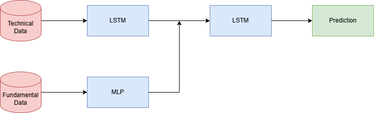
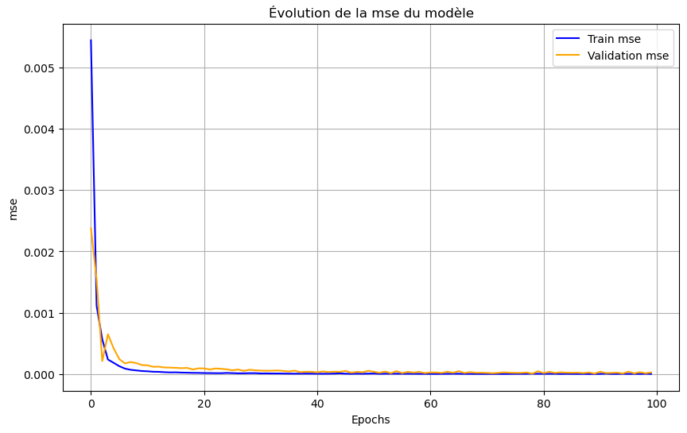

<h1 align="center">Technical & Fundamental analysis in stock market prediction</h1>

  

    <a href="#introduction">Introduction</a> •
    <a href="#method">Method</a> •
    <a href="#results">Results</a> •
    <a href="#conclusion">Conclusion</a>

## Introduction
Financial prediction models rely on two main types of data: **technical** and **fundamental**.  

- **Technical data** includes price movements, trading volumes, and other market indicators. It is primarily used for **short-term predictions**, capturing market trends and momentum.  
- **Fundamental data** consists of company earnings, economic indicators, and financial statements. It provides insights into a company’s intrinsic value, making it more relevant for **long-term forecasting**.  

Combining these two approaches is **challenging**, as technical data reacts quickly to market conditions, while fundamental data evolves more slowly. This project explores how to integrate both types of data to improve financial predictions, balancing short-term reactivity with long-term stability.  

## Method
We utilized datasets from the Nasdaq-100 index. Initially, we implemented a simple LSTM model to predict the Closing price one day ahead. The model consisted of two LSTM layers with Dropout layers for regularization. The input sequences were 60 days long, predicting one day in the future.

To explore long-term predictions, we tested an LSTM model predicting stock prices one year ahead. The results were poor, with no accuracy and a negative R² score, indicating the challenge of long-term stock market predictions using simple deep learning techniques.

To improve performance, we developed a hybrid model combining technical and fundamental data. The architecture includes:
- An LSTM network processing technical indicators.
- A Multi-Layer Perceptron (MLP) extracting information from fundamental data.
- A fusion layer merging insights from both models.
- A final LSTM layer generating stock price predictions.

  

The dataset was normalized, with sequences spanning 30 days before and 3 days after the annual report release. Data was split into training (70%), validation (10%), and testing (20%).

## Results
The simple LSTM model for one-day-ahead prediction performed well, achieving an MAE of 0.0350 and an R² score of 0.9077. However, the one-year-ahead LSTM model performed poorly, confirming that long-term market trends are difficult to predict using such approaches.

The hybrid model significantly improved prediction accuracy. Training and validation curves showed smooth convergence, with no major overfitting. The integration of fundamental data alongside technical indicators enhanced predictive performance compared to LSTM alone.

| Metric           | Value  | Day |
|-----------------|--------|-----|
| **MAE**         | 0.0070 | 1   |
| **R²**          | 0.9804 |     |
| **Accuracy (5%)** | 97.67% |     |
| **MAE**         | 0.0066 | 2   |
| **R²**          | 0.9788 |     |
| **Accuracy (5%)** | 97.67% |     |
| **MAE**         | 0.0077 | 3   |
| **R²**          | 0.9732 |     |
| **Accuracy (5%)** | 96.51% |     |

The following training curve illustrates the model's learning process, showing the evolution of the mse error over epochs.

  

## Conclusion
This study demonstrates that integrating fundamental data into short-term stock prediction models can improve accuracy. While a simple LSTM can effectively predict stock prices over a day, long-term predictions remain challenging. The hybrid model, combining technical and fundamental data, outperforms standard LSTM models, highlighting the importance of multi-source financial analysis for better stock price forecasting.